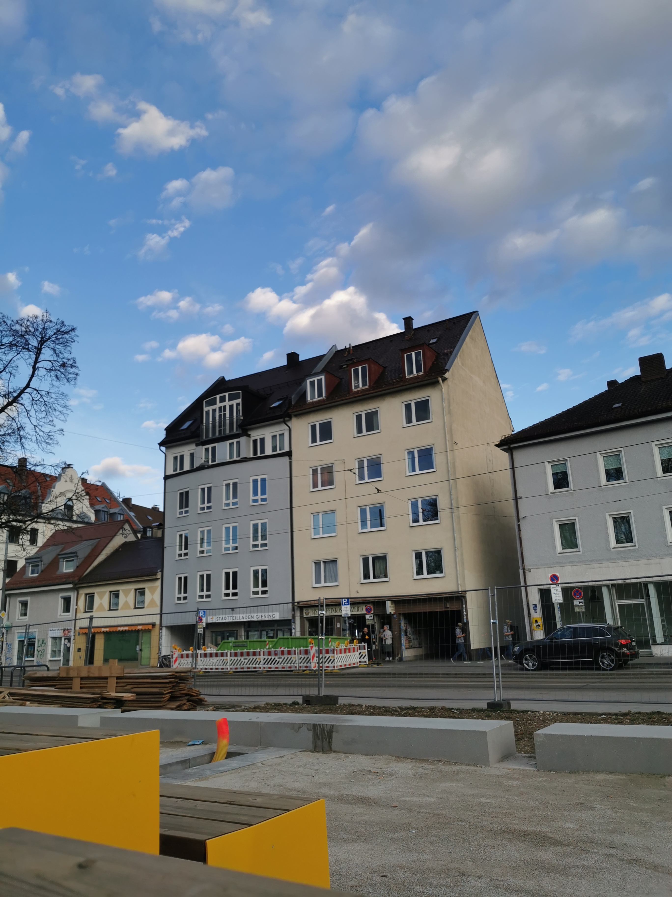
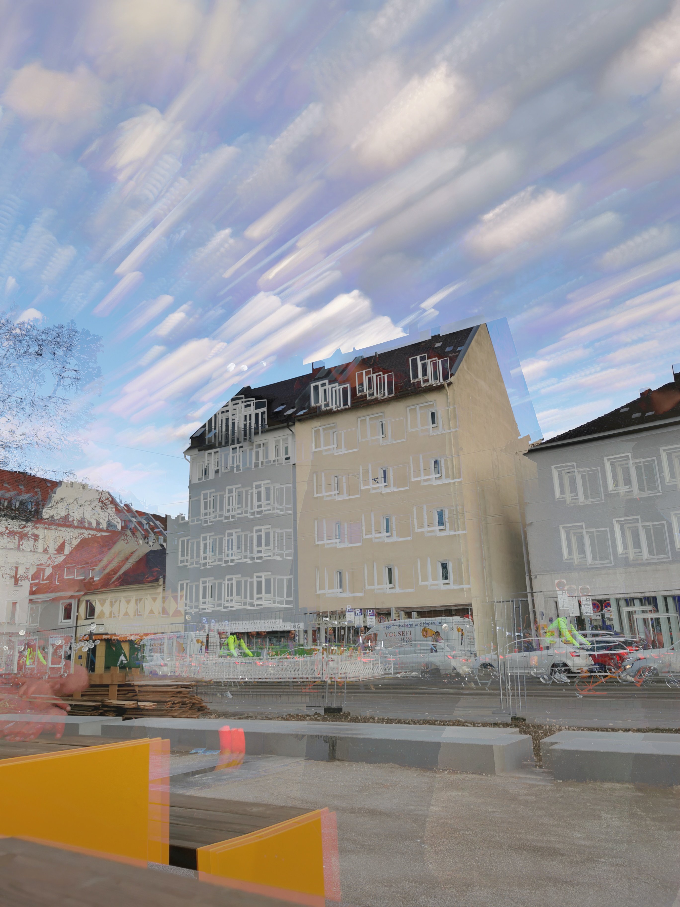

# timestack_blend_animation
Short python script to generate animations fom a set of timestack frames


# Timestack Blend

Create cumulative blend timelapse videos from image sequences. Perfect for capturing motion trails of birds, clouds, traffic, or any moving subjects.

## Features

- **Cumulative blending**: Each frame shows accumulated light trails up to that point
- **Auto video rendering**: Generates MP4 output automatically
- **RAW support**: Process Canon CR2, Nikon NEF, Sony ARW files
- **Mixed orientations**: Handles portrait/landscape images in same sequence
- **Memory efficient**: Processes large image sequences without loading everything into memory

## Sample Images

### Single Frame


### All Frames Stacked


### Output Video


## Installation

```bash
pip install opencv-python numpy
pip install rawpy  # For RAW file support
```

Requires `ffmpeg` for video rendering.

## Usage

```bash
# Process images from folder
python timestack_blend.py /path/to/images

# Specify output folder
python timestack_blend.py /path/to/images /path/to/output
```

Or edit `INPUT_DIR` in the script directly.

## Configuration

```python
# Video settings
RENDER_VIDEO = True
FPS = 30
VIDEO_QUALITY = "high"  # high, medium, low

# Processing
scale_factor = 0.5  # Resize for performance
```

## Supported Formats

**Input**: JPG, PNG, TIFF, CR2, NEF, ARW, RAF, ORF, RW2, DNG  
**Output**: MP4 video + individual frame sequence

## How It Works

1. Reads image sequence chronologically
2. Applies lighten blend mode cumulatively
3. Exports each cumulative frame
4. Renders frames into timelapse video

Perfect for creating motion trail videos where light paths build up over time.

## License

MIT
