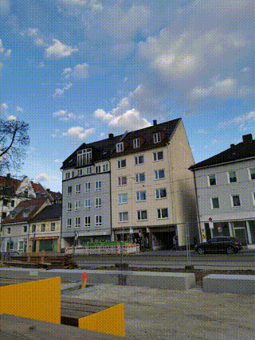

# timestack_blend_animation
Short python script to generate animations from a set of timestack frames


# Timestack Blend

Create cumulative blend timelapse videos from image sequences. Perfect for capturing motion trails of birds, clouds, traffic, or any moving subjects.

## Features

- **Cumulative blending**: Each frame shows accumulated light trails up to that point
- **Auto video rendering**: Generates MP4 output automatically
- **RAW support**: Process Canon CR2, Nikon NEF, Sony ARW files
- **Mixed orientations**: Handles portrait/landscape images in same sequence
- **Memory efficient**: Processes large image sequences without loading everything into memory
- **Video file support**: Extract frames directly from video files
- **Image alignment**: Automatically align shaky or handheld sequences
- **Auto-cropping**: Intelligently crop aligned sequences to remove black borders
- **Sliding window mode**: Create animations with fixed-length trails
- **Multiple blend modes**: Choose from 8 different blend algorithms
- **Batch processing**: Process all blend modes in a single command

## Sample Images

<table>
<tr>
<td align="center"><strong>Single Frame</strong></td>
<td align="center"><strong>All Frames Stacked</strong></td>
<td align="center"><strong>Output Video</strong></td>
</tr>
<tr>
<td></td>
<td></td>
<td></td>
</tr>
</table>


## Installation

```bash
pip install opencv-python numpy
pip install rawpy  # For RAW file support
```

Requires `ffmpeg` for video rendering.

## Usage

```bash
# Process images from folder
python timestack_blend.py /path/to/images

# Specify output folder
python timestack_blend.py /path/to/images /path/to/output

# Process with sliding window mode (last 30 frames)
python timestack_blend.py /path/to/images --slide

# Process with automatic image alignment
python timestack_blend.py /path/to/images --align

# Extract frames from video file and process
python timestack_blend.py /path/to/video.mp4

# Create timestack with all blend modes
python timestack_blend.py /path/to/images -b all

# Process RAW files
python timestack_blend.py /path/to/raw_files -t raw
```

Or edit `INPUT_DIR` in the script directly.

## Command Structure

The script supports multiple command modes:

```bash
# Create timestack animation (default)
python timestack_blend.py timestack /path/to/images [options]

# Analyze a video file without extraction
python timestack_blend.py analyze-video /path/to/video.mp4

# Extract frames from a video file
python timestack_blend.py extract-frames /path/to/video.mp4 [options]
```

## Configuration Options

```
# Basic options
-b, --blend BLEND     Blending mode: lighten, darken, lighter_color, darker_color, 
                      difference, multiply, screen, overlay, all
-s, --scale SCALE     Scale factor for processing (default: 1.0)
--no-video            Don't render video, only create frames
-f, --fps FPS         Video framerate (default: 30)
-q, --quality QUALITY Video quality: high, medium, low (default: high)
-t, --type TYPE       Force file type: auto, jpg, png, raw (default: auto-detect)

# Alignment and cropping options
--align               Enable image alignment using feature detection
--no-auto-crop        Disable automatic cropping (cropping is auto-enabled with alignment)

# Sliding window options
--slide               Use sliding window mode where only most recent N frames contribute
--swl WINDOW_SIZE     Number of frames in sliding window (default: 30)
--simplified-align    Use translation-only alignment for faster processing
--align-scale SCALE   Scale factor for feature detection during alignment (default: 0.5)
--batch-size SIZE     Batch size for alignment processing (default: 50)
--use-cache           Cache aligned images to disk if memory is constrained
```

## Blend Modes

- **lighten**: Keeps the brightest pixel from each frame (ideal for light trails)
- **darken**: Keeps the darkest pixel from each frame (good for dark moving objects)
- **lighter_color**: Selects the pixel with higher luminance
- **darker_color**: Selects the pixel with lower luminance
- **difference**: Shows the absolute difference between frames
- **multiply**: Multiplies pixel values (darkens the image)
- **screen**: Inverse multiply of inverted images (lightens the image)
- **overlay**: Combination of multiply and screen based on base image brightness

## Supported Formats

**Input**: JPG, PNG, TIFF, CR2, NEF, ARW, RAF, ORF, RW2, DNG, MP4, MOV, AVI  
**Output**: MP4 video + individual frame sequence

## How It Works

### Standard Mode
1. Reads image sequence chronologically
2. Applies selected blend mode cumulatively
3. Exports each cumulative frame
4. Renders frames into timelapse video

### Sliding Window Mode
1. Maintains a buffer of the N most recent frames
2. Each output frame shows only trails from the window of frames
3. Creates a consistent trail length throughout the video

### Alignment Process
1. Detects keypoints in each image using ORB or SIFT features
2. Matches corresponding points between frames
3. Calculates transformation matrices using RANSAC
4. Applies perspective transformation to align images
5. Auto-crops to remove black borders

## License

MIT
